<div class="text-center my-auto bg-dark-900/80 p-10 rounded-3xl border border-blue-500/30 shadow-[0_0_40px_rgba(59,130,246,0.3)] backdrop-blur-md max-w-4xl mx-auto transform hover:scale-105 transition-transform duration-500">

<h1 class="text-6xl font-black tracking-tight leading-tight bg-gradient-to-r from-cyan-400 via-blue-400 to-indigo-500 bg-clip-text text-transparent drop-shadow-lg mb-4">CI/CD Pipelines</h1>

<div class="w-32 h-1 bg-gradient-to-r from-cyan-400 to-indigo-500 my-6 mx-auto rounded-full shadow-[0_0_10px_rgba(56,189,248,0.8)]"></div>

<h2 class="text-2xl font-semibold mt-2 text-gray-200">Heriberto Luna</h2>
<p class="text-lg text-gray-400 font-medium tracking-wide">Florida International University CIARA</p>

</div>

---
transition: slide-up
layout: two-cols-header
---

# Table of Contents
<p class="opacity-75 -mt-4 mb-6">Core topics and presentation roadmap</p>

::left::

<div class="pr-3 space-y-3">
  <div v-click class="p-3 bg-neutral-800/60 rounded-lg border border-neutral-700/80 flex items-center gap-3 shadow-sm">
    <div class="p-2 bg-blue-500/20 rounded-md text-blue-400"><div class="i-carbon-network-4 text-xl inline-block"></div></div>
    <div>
      <div class="font-bold text-sm text-white/90">01. What is CI/CD?</div>
      <div class="text-xs opacity-70">Fundamentals, pipelines & continuous security</div>
    </div>
  </div>

  <div v-click class="p-3 bg-neutral-800/60 rounded-lg border border-neutral-700/80 flex items-center gap-3 shadow-sm">
    <div class="p-2 bg-purple-500/20 rounded-md text-purple-400"><div class="i-carbon-help text-xl inline-block"></div></div>
    <div>
      <div class="font-bold text-sm text-white/90">02. The Research Problem</div>
      <div class="text-xs opacity-70">Modern pipeline challenges & research questions</div>
    </div>
  </div>

  <div v-click class="p-3 bg-neutral-800/60 rounded-lg border border-neutral-700/80 flex items-center gap-3 shadow-sm">
    <div class="p-2 bg-green-500/20 rounded-md text-green-400"><div class="i-carbon-chart-line text-xl inline-block"></div></div>
    <div>
      <div class="font-bold text-sm text-white/90">03. Business Value & Benefits</div>
      <div class="text-xs opacity-70">Why stakeholders care about automation ROI</div>
    </div>
  </div>

  <div v-click class="p-3 bg-neutral-800/60 rounded-lg border border-neutral-700/80 flex items-center gap-3 shadow-sm">
    <div class="p-2 bg-amber-500/20 rounded-md text-amber-400"><div class="i-carbon-settings text-xl inline-block"></div></div>
    <div>
      <div class="font-bold text-sm text-white/90">04. Local & External Automation</div>
      <div class="text-xs opacity-70">From Git hooks to cloud-based runners</div>
    </div>
  </div>
</div>

::right::

<div class="pl-3 space-y-3">
  <div v-click class="p-3 bg-neutral-800/60 rounded-lg border border-neutral-700/80 flex items-center gap-3 shadow-sm">
    <div class="p-2 bg-cyan-500/20 rounded-md text-cyan-400"><div class="i-carbon-flow text-xl inline-block"></div></div>
    <div>
      <div class="font-bold text-sm text-white/90">05. CI & CD Implementations</div>
      <div class="text-xs opacity-70">React frontend vs. advanced Rust/Python backend</div>
    </div>
  </div>

  <div v-click class="p-3 bg-neutral-800/60 rounded-lg border border-neutral-700/80 flex items-center gap-3 shadow-sm">
    <div class="p-2 bg-red-500/20 rounded-md text-red-400"><div class="i-carbon-cloud-app text-xl inline-block"></div></div>
    <div>
      <div class="font-bold text-sm text-white/90">06. GitOps Architecture</div>
      <div class="text-xs opacity-70">Orchestration with k3s, ArgoCD & Ansible</div>
    </div>
  </div>

  <div v-click class="p-3 bg-neutral-800/60 rounded-lg border border-neutral-700/80 flex items-center gap-3 shadow-sm">
    <div class="p-2 bg-pink-500/20 rounded-md text-pink-400"><div class="i-carbon-bot text-xl inline-block"></div></div>
    <div>
      <div class="font-bold text-sm text-white/90">07. AI Integration & Improvements</div>
      <div class="text-xs opacity-70">Automated reviews with CodiumAI PR Agent</div>
    </div>
  </div>
</div>

---
layout: two-cols
transition: slide-left
---

# What is CI/CD?

::left::
<v-click>
<div class="bg-gray-900/60 border border-gray-700 rounded-xl p-6 mr-4 shadow-xl backdrop-blur-sm h-full hover:border-cyan-500 transition-colors duration-300">
  <div class="text-5xl mb-4 drop-shadow-[0_0_10px_rgba(34,211,238,0.5)]">🧩</div>
  <h3 class="text-2xl font-bold text-cyan-400 mb-2">Continuous Integration</h3>
  <p class="text-gray-300 leading-relaxed">
    The practice of automating the different workflows that need to take place in order to <strong>integrate/add code</strong> into a project.
  </p>
</div>
</v-click>

::right::
<v-click>
<div class="bg-gray-900/60 border border-gray-700 rounded-xl p-6 shadow-xl backdrop-blur-sm h-full hover:border-indigo-500 transition-colors duration-300">
  <div class="text-5xl mb-4 drop-shadow-[0_0_10px_rgba(129,140,248,0.5)]">🚀</div>
  <h3 class="text-2xl font-bold text-indigo-400 mb-2">Continuous Deployment</h3>
  <p class="text-gray-300 leading-relaxed">
    The practice of automating the releases of your software into a <strong>production environment</strong>. Whenever you finish writing code and adding it into your project, the continuous deployment pipeline is responsible for automatically releasing it into production.
  </p>
</div>
</v-click>

---
layout: image-right
image: https://images.unsplash.com/photo-1518770660439-4636190af475?auto=format&fit=crop&w=1000&q=80
---

# What are CI/CD Pipelines?

<div class="bg-blue-950/40 border-l-4 border-blue-500 p-6 rounded-r-xl mt-10 shadow-lg backdrop-blur-md text-xl leading-relaxed text-gray-200">
Your <strong>CI/CD pipeline</strong> is your set of automated workflows in order to continuously integrate code into a project and release it into production.
</div>

---
transition: slide-up
layout: default
---

# Continuous Security (CS)
<p class="opacity-75 -mt-4 mb-4">Continuous Security (DevSecOps)</p>

<div class="flex justify-between grid-cols-3 gap-4 my-4 ">

  <div v-click class="p-4 bg-neutral-800/60 rounded-lg border border-neutral-700 flex flex-col justify-between hover:border-purple-500/50 transition-colors">
    <div>
      <div class="p-2 bg-purple-500/20 rounded-md text-purple-400 w-fit mb-3">
        <div class="i-carbon-code text-2xl inline-block"></div>
      </div>
      <h3 class="text-base font-bold text-white mb-2">SAST & Secret Auditing</h3>
      <p class="text-xs opacity-80 leading-relaxed">
        Static Application Security Testing scans uncompiled source code, Dockerfiles, and IaC for vulnerability patterns, SQL injection risks, and leaked API credentials.
      </p>
    </div>
    <div class="mt-4 pt-2 border-t border-neutral-700/60 text-[10px] text-purple-300 font-mono">
      ✓ Static Code & IaC Analysis
    </div>
  </div>

  <div v-click class="p-4 bg-neutral-800/60 rounded-lg border border-neutral-700 flex flex-col justify-between hover:border-cyan-500/50 transition-colors">
    <div>
      <div class="p-2 bg-cyan-500/20 rounded-md text-cyan-400 w-fit mb-3">
        <div class="i-carbon-flash text-2xl inline-block"></div>
      </div>
      <h3 class="text-base font-bold text-white mb-2">DAST & Runtime Defense</h3>
      <p class="text-xs opacity-80 leading-relaxed">
          Dynamic Application Security Testing checks for security vulnerabilities while your code is running.
      </p>
    </div>
    <div class="mt-4 pt-2 border-t border-neutral-700/60 text-[10px] text-cyan-300 font-mono">
      ✓ Dynamic Exploit Scanning
    </div>
  </div>
</div>

<div v-click class="p-3 bg-neutral-900/90 rounded-xl border border-neutral-700 text-center text-xs opacity-90 shadow-md">
  🛡️ <strong>CI-CS-CD Paradigm:</strong> Standard CI validates functional logic; Continuous Security verifies structural integrity and prevents supply-chain exploits before production deployment.
</div>

---
transition: fade
layout: image-right
image: https://images.unsplash.com/photo-1526374965328-7f61d4dc18c5?q=80&w=1000&auto=format&fit=crop
---

# The Research Problem
<p class="opacity-75 -mt-4 mb-6">Addressing the challenges of modern web application delivery</p>

<div v-click class="mb-5">
  <p class="text-sm opacity-90 leading-relaxed">
    As modern software systems grow in complexity, organizations struggle to standardize workflows across multiple languages, package managers, and build systems. This research focuses on solving the following challenges:
  </p>
</div>

<div v-click class="p-4 my-4 bg-purple-950/40 border-l-4 border-purple-500 rounded-r-lg shadow-lg">
  <div class="flex items-center gap-2 text-purple-400 font-semibold text-xs uppercase tracking-wider mb-2">
    <div class="i-carbon-help text-base inline-block"></div> Research Question 1
  </div>
  <blockquote class="text-base font-medium italic text-white/95 m-0 border-none pl-0 leading-snug">
    “How can a modern CI/CS/CD pipeline for frontend and backend web applications be developed?”
  </blockquote>
</div>

<div v-click class="p-4 my-4 bg-cyan-950/40 border-l-4 border-cyan-500 rounded-r-lg shadow-lg">
  <div class="flex items-center gap-2 text-cyan-400 font-semibold text-xs uppercase tracking-wider mb-2">
    <div class="i-carbon-bot text-base inline-block"></div> Research Question 2
  </div>
  <blockquote class="text-base font-medium italic text-white/95 m-0 border-none pl-0 leading-snug">
    “How can AI be integrated into a modern CI/CS/CD pipeline?”
  </blockquote>
</div>

---
transition: slide-up
layout: two-cols-header
---

# Business Value & ROI
<p class="opacity-75 -mt-4 mb-4">Why non-technical stakeholders care about CI/CD automation</p>

::left::

<div class="pr-3">
  <div class="p-4 bg-red-950/30 border border-red-800/50 rounded-lg shadow-sm">
    <div class="flex items-center gap-2 text-red-400 font-bold text-base mb-2">
      <div class="i-carbon-warning text-lg inline-block"></div> The Manual Delivery Trap
    </div>
    <ul class="text-sm space-y-3 opacity-90 pl-4 list-disc">
      <li v-click><strong>Slow Time-to-Market:</strong> Manual handoffs and testing delay critical feature releases by weeks or months.</li>
      <li v-click><strong>High Production Risk:</strong> Human error during manual deployments leads to costly outages and emergency hotfixes.</li>
      <li v-click><strong>Resource Waste:</strong> Engineering hours are consumed by repetitive manual verification instead of building core business value.</li>
    </ul>
  </div>
</div>

::right::

<div class="pl-3">
  <div class="p-4 bg-green-950/30 border border-green-800/50 rounded-lg shadow-sm">
    <div class="flex items-center gap-2 text-green-400 font-bold text-base mb-2">
      <div class="i-carbon-chart-line text-lg inline-block"></div> The Automated CI/CD Advantage
    </div>
    <ul class="text-sm space-y-3 opacity-90 pl-4 list-disc">
      <li v-click><strong>Rapid Innovation:</strong> Continuous integration enables releasing small, verified updates multiple times a day.</li>
      <li v-click><strong>Predictable Quality:</strong> Automated testing and AI reviews catch regressions before they ever impact customers.</li>
      <li v-click><strong>Maximized ROI:</strong> Drastically reduces operational overhead, lowering total cost of ownership (TCO) and boosting customer retention.</li>
    </ul>
  </div>
</div>

---
transition: slide-left
layout: default
---

# Visualizing Business Impact
<p class="opacity-75 -mt-4 mb-3">Comparing pipeline efficiency and financial outcomes</p>

<div class="flex flex-col items-center py-8 gap-12">

  <!-- Legacy Flow (Appears first) -->
  <v-click>

  ```mermaid {theme: 'dark', scale: 0.6}
  flowchart LR
    subgraph Manual ["❌ Legacy Manual Delivery"]
        direction LR
        M1["Long Dev Cycles"] --> M2["Manual QA & Handoffs"]
        M2 --> M3["Infrequent High-Risk Releases"]
        M3 --> M4["Production Defects & Downtime"]
        M4 --> M5["📉 Lost Revenue & High Costs"]
    end
    style M5 fill:#5c1d1d,stroke:#ff4d4d,color:#fff
  ```
  </v-click>

  <!-- Modern Flow (Appears on next click) -->
  <v-click>

  ```mermaid {theme: 'dark', scale: 0.6}
  flowchart LR
    subgraph Auto ["⚡ Modern CI/CD & GitOps Pipeline"]
        direction LR
        A1["Continuous Small Commits"] --> A2["Automated Checks & Fast Feedback"]
        A2 --> A3["AI Review & Security Scans"]
        A3 --> A4["Automated Zero-Downtime Deploy"]
        A4 --> A5["📈 Maximum ROI & Growth"]
    end
    style A5 fill:#1a4d2e,stroke:#4dff88,color:#fff
  ```
  </v-click>

</div>

---
layout: default
---

# Story Introduction

<div class="grid grid-cols-2 gap-6 mt-8">

<v-click>
<div class="bg-gray-900/50 p-6 rounded-xl border border-gray-700 shadow-lg flex items-start gap-4 transform transition-transform hover:-translate-y-1">
  <div class="text-4xl">👨‍💻</div>
  <div>
    <p class="text-lg text-gray-200">You are a software developer, and you want to create a website.</p>
  </div>
</div>
</v-click>

<v-click>
<div class="bg-emerald-950/30 p-6 rounded-xl border border-emerald-900 shadow-lg flex items-start gap-4 transform transition-transform hover:-translate-y-1">
  <div class="i-logos-vue text-4xl"></div>
  <div>
    <p class="text-lg text-gray-200">You learn about a front-end framework like <strong>Vue.js</strong> and start writing code.</p>
  </div>
</div>
</v-click>

<v-click>
<div class="bg-orange-950/30 p-6 rounded-xl border border-orange-900 shadow-lg flex items-start gap-4 transform transition-transform hover:-translate-y-1">
  <div class="i-logos-git text-4xl"></div>
  <div>
    <p class="text-lg text-gray-200">It's hard to keep track of changes, so you use <strong>Git</strong> to manage the version history of the application.</p>
  </div>
</div>
</v-click>

<v-click>
<div class="bg-gray-800/80 p-6 rounded-xl border border-gray-600 shadow-lg flex items-start gap-4 transform transition-transform hover:-translate-y-1">
  <div class="i-logos-github-icon text-4xl bg-white rounded-full"></div>
  <div>
    <p class="text-lg text-gray-200">You want to work with others and safely store code, so you utilize a <strong>GitHub repository</strong>.</p>
  </div>
</div>
</v-click>

</div>

---
layout: two-cols
transition: slide-up
---

# The Problem & The Build System

::left::

<div class="mt-8">
  <div class="bg-blue-900/20 border-l-4 border-blue-400 p-4 rounded-r-lg mb-8">
    <div class="text-2xl mb-2">🤔 <strong>How will you manage your project?</strong></div>
    <div class="text-xl"><strong>How will you build your code into something usable?</strong></div>
  </div>

  <v-click>
  <p class="text-lg text-gray-300 leading-relaxed">
    You need a build system; let's say you use <strong>Vite</strong> in order to build your Vue.js front-end web application.
  </p>
  </v-click>
</div>

::right::

<div class="flex flex-col justify-center items-center h-full ml-12">
  <div class="bg-gray-900/50 p-6 rounded-2xl border border-gray-700 w-full flex justify-center">

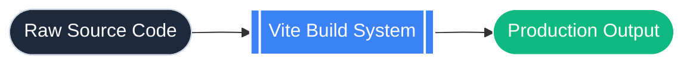

  </div>
</div>

---
layout: default
---

# Static Analysis: The Need

<div class="text-lg text-gray-300 mb-6 bg-gray-900/50 p-4 rounded-xl border border-gray-700">
  You want to keep your code high quality and avoid syntax errors, so you introduce <strong>static analysis tools</strong> like a linter and a formatter. Static analysis tools scan your raw unexecuted code for issues.
</div>

<v-click>
<div class="grid grid-cols-2 gap-8 mt-4">
  
  <div class="bg-red-950/20 border border-red-900 p-4 rounded-xl">
    <div class="text-red-400 font-bold mb-2">❌ Before Formatting</div>

```javascript
const add=(a,b )=> {
return a+b;}
```

  </div>

  <div class="bg-emerald-950/20 border border-emerald-900 p-4 rounded-xl">
    <div class="text-emerald-400 font-bold mb-2">✅ After Formatting</div>

```javascript
const add = (a, b) => {
  return a + b;
};
```

  </div>

</div>
</v-click>

---
layout: default
---

# Linters and Formatters Explained

<div class="grid grid-cols-2 gap-8 mt-10">

<div v-click class="bg-gradient-to-br from-gray-900 to-gray-800 p-6 rounded-2xl border border-gray-700 shadow-xl relative overflow-hidden">
  <div class="absolute top-0 left-0 w-full h-1 bg-cyan-400"></div>
  <h3 class="text-2xl font-bold text-cyan-300 mb-4 flex items-center gap-2"><div class="i-carbon-text-align-left text-3xl"></div> Formatter</h3>
  <p class="text-gray-300 text-lg leading-relaxed">
    A formatter is very simple; it checks and corrects the <strong>style</strong> of your code. It makes sure it follows proper formats and is easy to read. It makes sure you use proper indentation, quote usage, semicolon usage, etc.
  </p>
</div>

<div v-click class="bg-gradient-to-br from-gray-900 to-gray-800 p-6 rounded-2xl border border-gray-700 shadow-xl relative overflow-hidden">
  <div class="absolute top-0 left-0 w-full h-1 bg-purple-400"></div>
  <h3 class="text-2xl font-bold text-purple-300 mb-4 flex items-center gap-2"><div class="i-carbon-warning text-3xl"></div> Linter</h3>
  <p class="text-gray-300 text-lg leading-relaxed">
    A linter will check your code for <strong>syntax errors</strong>; it will make sure that it is logically sound, it will make sure it follows best practices, and it will introduce no “anti-patterns” or things that would make your code worse.
  </p>
</div>

</div>

---
layout: center
---

# Updating the Pipeline (Static Analysis)

<p class="text-xl text-gray-300 text-center mb-8">Let's add Static Analysis to our workflow.</p>

<div class="flex justify-center w-full mt-4">
    <div class="bg-gray-900/60 p-8 rounded-3xl border border-gray-700 shadow-2xl backdrop-blur-md">

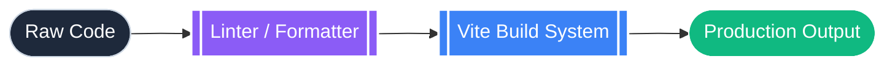

</div>
</div>

---
layout: image-left
image: https://images.unsplash.com/photo-1581276879432-15e50529f34b?auto=format&fit=crop&w=1000&q=80
---

<div class="-mt-7">

# Testing?

<div class="space-y-3">

<v-click>
<div class="bg-gray-900/80 p-3 rounded-lg border-l-4 border-indigo-500">
  <p class="text-gray-200 text-sm leading-snug">Your code is now beautiful, properly formatted, and linted. It can also build and be displayed, but <strong>how are you going to test it</strong>, making sure that every single component works properly as it should?</p>
</div>
</v-click>

<v-click>
<div class="bg-gray-900/80 p-3 rounded-lg border-l-4 border-amber-500">
  <p class="text-gray-200 text-sm leading-snug">You could test it manually by yourself; you could have a list of things that you need to click on after every change, but <strong>that is too tedious and will not scale</strong>.</p>
</div>
</v-click>

<v-click>
<div class="bg-gray-900/80 p-3 rounded-lg border-l-4 border-emerald-500">
  <p class="text-gray-200 text-sm leading-snug">What happens if you have a thousand buttons that you have to click on? That is when you utilize a <strong>testing framework</strong>. You basically just write a program that will test your application for you, and you can reuse it whenever you want.</p>
</div>
</v-click>

</div>

</div>

---
layout: default
---

# Types of Tests

<p class="text-lg text-gray-300 mb-6 bg-gray-900/50 p-4 rounded-xl border border-gray-700">
  There are many types of tests that you can do, but the two main types of tests that you will be utilizing are <strong>unit</strong> and <strong>end-to-end (E2E)</strong> tests.
</p>

<div class="grid grid-cols-2 gap-8">

<v-click>
<div class="bg-blue-950/30 p-6 rounded-xl border border-blue-900 hover:shadow-[0_0_20px_rgba(59,130,246,0.3)] transition-shadow">
  <h3 class="text-xl font-bold text-blue-400 mb-3">Unit Tests</h3>
  <p class="text-gray-300">
    Unit tests are written in order to make sure that small parts of your code work like individual functions or components.
  </p>
</div>
</v-click>

<v-click>
<div class="bg-emerald-950/30 p-6 rounded-xl border border-emerald-900 hover:shadow-[0_0_20px_rgba(16,185,129,0.3)] transition-shadow">
  <h3 class="text-xl font-bold text-emerald-400 mb-3">End-to-End (E2E) Tests</h3>
  <p class="text-gray-300">
    E2E tests make sure your entire application works. They test the application end-to-end, covering multiple sections of it at once. It represents common workflows that your program will perform (e.g., submitting a form, storing data in a DB).
  </p>
</div>
</v-click>

</div>

---
layout: two-cols
---

# Testing in Action

::left::

<div class="mr-4 flex flex-col justify-center h-full my-auto py-6 space-y-6">
  <div>
    <h3 class="font-bold text-blue-400 mb-3 text-lg flex items-center gap-2"><div class="i-logos-vitest text-xl"></div> Unit Test (Vitest)</h3>

```javascript
import { expect, test } from 'vitest'
import { add } from './math'

test('adds 1 + 2 to equal 3', () => {
  expect(add(1, 2)).toBe(3)
})
```
  </div>
  <div class="bg-blue-950/20 border border-blue-900/50 p-4 rounded-xl text-xs text-gray-300 leading-relaxed">
    💡 <strong>Fast Verification:</strong> Unit tests execute in milliseconds in Node.js, verifying isolated business logic before bundling.
  </div>
</div>

::right::

<div class="ml-4 flex flex-col justify-center h-full my-auto py-6 space-y-6">
  <div>
    <h3 class="font-bold text-emerald-400 mb-3 text-lg flex items-center gap-2"><div class="i-logos-cypress text-xl"></div> E2E Test (Cypress)</h3>

```javascript
describe('Form Submission', () => {
  it('submits successfully', () => {
    cy.visit('/form')
    cy.get('input[name="email"]').type('user@test.com')
    cy.get('button[type="submit"]').click()
    cy.contains('Success!')
  })
})
```
  </div>
  <div class="bg-emerald-950/20 border border-emerald-900/50 p-4 rounded-xl text-xs text-gray-300 leading-relaxed">
    💡 <strong>User Journey Testing:</strong> E2E tests run in a real browser, verifying complete user workflows and DOM interactions.
  </div>
</div>

---
layout: center
---

# Updating the Pipeline (Testing)

<p class="text-xl text-gray-300 text-center mb-8">Now our pipeline has automated testing.</p>

<div class="bg-gray-900/60 p-8 rounded-3xl border border-gray-700 shadow-2xl backdrop-blur-md">

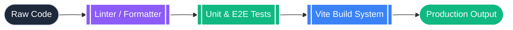

</div>

---
layout: image-right
image: https://images.unsplash.com/photo-1551288049-bebda4e38f71?auto=format&fit=crop&w=1000&q=80
---

# Profiling and Auditing

<div class="bg-orange-950/40 border-l-4 border-orange-500 p-6 rounded-r-xl mt-12 shadow-lg backdrop-blur-md text-xl leading-relaxed text-gray-200">
Now that your code is properly tested, you need to make sure that it is performant and memory efficient. This is when you use a <strong>profiler or auditor</strong>.
</div>

---
layout: center
---

# Updating the Pipeline (Profiling)

<p class="text-xl text-gray-300 text-center mb-8">The final step of our local code validation.</p>

<div class="bg-gray-900/60 p-8 rounded-3xl border border-gray-700 shadow-2xl backdrop-blur-md">
<Transform :scale="1.0">

```mermaid
graph LR
    A([Raw Code]) --> L[[Linter / Formatter]]
    L --> T[[Unit & E2E Tests]]
    T --> P[[Profiler / Auditor]]
    P --> B[[Vite Build System]]
    B --> C([Production Output])
    
    style L fill:#8b5cf6,stroke:#fff,stroke-width:2px,color:#fff
    style T fill:#10b981,stroke:#fff,stroke-width:2px,color:#fff
    style P fill:#f59e0b,stroke:#fff,stroke-width:2px,color:#fff
    style B fill:#3b82f6,stroke:#fff,stroke-width:2px,color:#fff
    style A fill:#1e293b,stroke:#cbd5e1,color:#fff
    style C fill:#10b981,stroke:#fff,color:#fff
```

</Transform>
</div>

---
layout: default
---

# Local Automation: The Need

<div class="grid grid-cols-2 gap-8 mt-10">

<div>
  <div class="text-3xl mb-4">⚙️</div>
  <h3 class="text-2xl font-bold text-gray-200 mb-4">The Workflow Problem</h3>
  <p class="text-gray-300 text-lg leading-relaxed bg-gray-900/50 p-4 rounded-xl border border-gray-700">
    You have all of the tools and you probably have your own workflow, but you have to do it all <strong>manually</strong>. How can you run it locally and automatically?
  </p>
</div>

<v-click>
<div>
  <div class="text-3xl mb-4">🪝</div>
  <h3 class="text-2xl font-bold text-cyan-400 mb-4">The Solution: Git Hooks</h3>
  <p class="text-gray-300 text-lg leading-relaxed bg-cyan-950/20 p-4 rounded-xl border border-cyan-900">
    The most common way is to utilize <strong>Git hooks and scripts</strong>. You can have some sort of script to download all of your dependencies and set up the git hooks.
  </p>
</div>
</v-click>

</div>

---
layout: two-cols
---

# How Git Hooks Work

::left::

<div class="mr-6 mt-8">
  <p class="text-gray-300 text-lg leading-relaxed bg-gray-900/50 p-5 rounded-xl border border-gray-700">
    Whenever you perform an action with Git, usually like committing code or pushing code to a repository, you can <strong>run a custom script</strong>. 
    <br><br>
    So whenever you try to commit code, you can make sure that your linters, formatters, and unit tests run so that everything functions properly <strong>before</strong> the commit is saved.
  </p>
</div>

::right::

<div class="mt-8 bg-gray-900/80 p-6 rounded-2xl border border-gray-700 shadow-xl flex justify-center">
<Transform :scale="0.9">

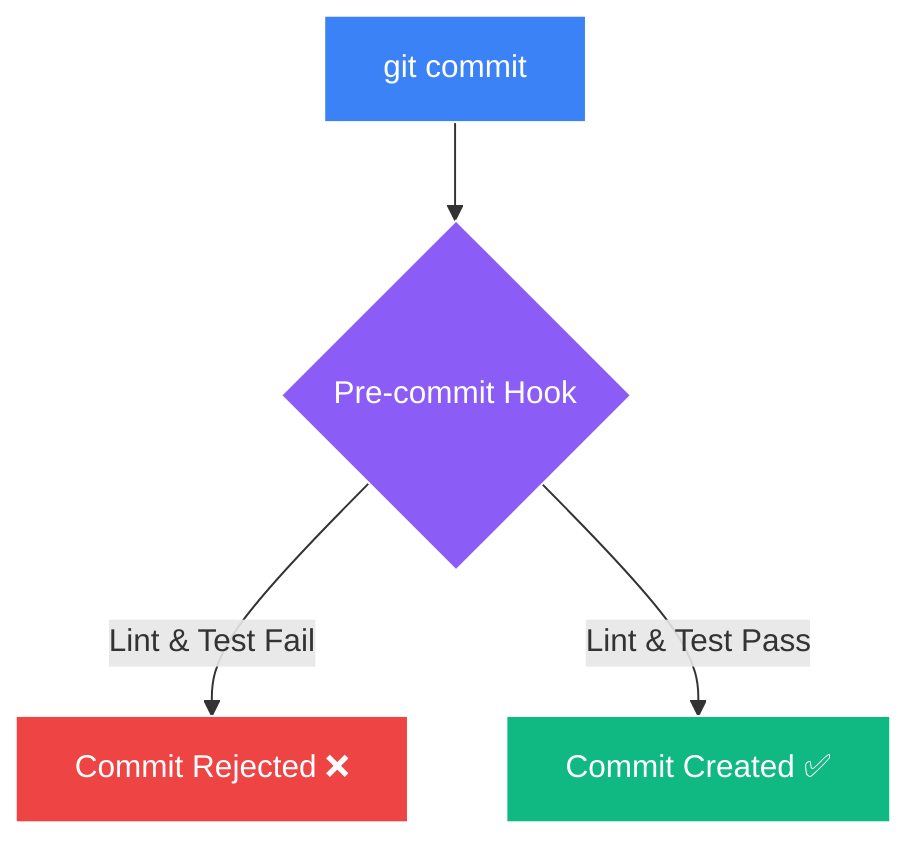

</Transform>
</div>

---
layout: image-right
image: https://images.unsplash.com/photo-1558494949-ef010cbdcc31?q=80&w=1000&auto=format&fit=crop
transition: zoom
zoom: 0.88
---

# External Automation

<div class="space-y-3 mt-2 bg-gray-900/60 p-4 rounded-2xl border border-gray-700 backdrop-blur-sm shadow-xl">

<v-click>
<div>
  <h3 class="text-lg font-bold text-red-400 mb-1 flex items-center gap-2">
    <div class="i-carbon-warning-alt text-lg"></div> The Trust Problem
  </h3>
  <p class="text-gray-300 text-xs leading-relaxed">
    You know how to validate your code locally, but what about externally within your repository? That is the most important part; <strong>someone could disable these automated workflows locally and push bad code to the repo.</strong>
  </p>
</div>
</v-click>

<v-click>
<div class="mt-3 pt-3 border-t border-gray-700/80">
  <h3 class="text-lg font-bold text-blue-400 mb-1 flex items-center gap-2">
    <div class="i-carbon-cloud-service-management text-lg"></div> The CI Server Solution
  </h3>
  <p class="text-gray-300 text-xs leading-relaxed">
    Your repo should validate everything as well. For GitHub, you could use something like <strong>GitHub Actions</strong> to execute your continuous integration pipeline in the same exact way, in a clean environment.
  </p>
</div>
</v-click>

</div>

---
layout: default
---

# Additional Functionality

<p class="text-sm text-gray-300 mb-5 bg-gray-900/50 px-4 py-2 rounded-xl border border-gray-700 inline-block">
  You have the basics of your CI pipeline done. There are a few more things that you could add:
</p>

<div class="flex flex-wrap justify-center gap-4 max-w-5xl mx-auto">

<div v-click class="w-[31%] bg-gray-900/80 p-4 rounded-2xl border border-gray-700 hover:border-blue-500 hover:shadow-[0_0_15px_rgba(59,130,246,0.3)] transition-all flex flex-col items-center text-center">
  <div class="text-3xl mb-2">📝</div>
  <div class="text-sm font-semibold text-gray-200">Automating changelog generation</div>
</div>

<div v-click class="w-[31%] bg-gray-900/80 p-4 rounded-2xl border border-gray-700 hover:border-purple-500 hover:shadow-[0_0_15px_rgba(168,85,247,0.3)] transition-all flex flex-col items-center text-center">
  <div class="text-3xl mb-2">📊</div>
  <div class="text-sm font-semibold text-gray-200">Automating project management & Scrum</div>
</div>

<div v-click class="w-[31%] bg-gray-900/80 p-4 rounded-2xl border border-gray-700 hover:border-emerald-500 hover:shadow-[0_0_15px_rgba(16,185,129,0.3)] transition-all flex flex-col items-center text-center">
  <div class="text-3xl mb-2">🚀</div>
  <div class="text-sm font-semibold text-gray-200">Automating releases</div>
</div>

<div v-click class="w-[31%] bg-gray-900/80 p-4 rounded-2xl border border-gray-700 hover:border-amber-500 hover:shadow-[0_0_15px_rgba(245,158,11,0.3)] transition-all flex flex-col items-center text-center">
  <div class="text-3xl mb-2">📦</div>
  <div class="text-sm font-semibold text-gray-200">Automating application building</div>
</div>

<div v-click class="w-[31%] bg-gray-900/80 p-4 rounded-2xl border border-gray-700 hover:border-cyan-500 hover:shadow-[0_0_15px_rgba(6,182,212,0.3)] transition-all flex flex-col items-center text-center">
  <div class="text-3xl mb-2">🌍</div>
  <div class="text-sm font-semibold text-gray-200">Testing across multiple environments</div>
</div>

</div>

---
layout: center
---

# Continuous Integration Complete

<div class="max-w-3xl mx-auto text-center mb-8">
  <p class="text-gray-300 text-lg bg-gray-900/50 p-4 rounded-xl border border-gray-700">
    Your continuous integration pipeline is now done, but how are you going to utilize it in multiple different projects and handle modifications? This is when a scaffolding tool like <strong>cookiecutter</strong> or <strong>copier</strong> comes in, which allows you to create reusable templates that are easy to manage.
  </p>
</div>

<div class="flex justify-center w-full">
<div class="bg-gray-900/60 p-6 rounded-3xl border border-gray-700 shadow-2xl backdrop-blur-md inline-block mx-auto">

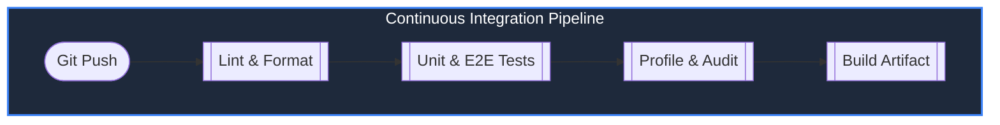

</div>
</div>

---
layout: cover
background: https://images.unsplash.com/photo-1451187580459-43490279c0fa?auto=format&fit=crop&w=1920&q=80
transition: zoom
---

<div class="text-center my-auto bg-dark-900/90 p-12 rounded-3xl border border-indigo-500/50 shadow-[0_0_50px_rgba(99,102,241,0.4)] backdrop-blur-xl max-w-4xl mx-auto transform transition-all duration-700 hover:scale-105">

<h1 class="text-5xl font-black tracking-tight leading-tight text-white mb-6">The Next Frontier</h1>

<p class="text-2xl text-indigo-300 font-light leading-relaxed">
  We've built a pristine artifact.<br>
  But an artifact sitting in a registry provides <strong>zero value</strong> to the user.
</p>

<div class="w-24 h-1 bg-indigo-500 my-8 mx-auto rounded-full shadow-[0_0_10px_rgba(99,102,241,0.8)]"></div>

<p class="text-3xl font-bold bg-gradient-to-r from-cyan-400 to-indigo-400 bg-clip-text text-transparent">
  How do we ship it safely?
</p>

</div>

---
layout: default
---

# The Challenge of Continuous Deployment

<div class="grid grid-cols-2 gap-8 mt-10">

<div>
  <p class="text-gray-300 text-lg leading-relaxed mb-6">
    With the continuous integration pipeline now complete, we can now go into the <strong>continuous deployment pipeline</strong>.
  </p>
  
  <v-click>
  <div class="bg-red-950/20 p-5 rounded-xl border border-red-900 border-l-4 border-l-red-500 mb-6">
    <p class="text-gray-300">
      Continuous deployment is <strong>not easy</strong>, because there are many different types of projects and applications that can be built and a lot of ways to release them.
    </p>
  </div>
  </v-click>
</div>

<div>
  <v-click>
  <div class="bg-gray-900/60 p-5 rounded-xl border border-gray-700 mb-4 hover:border-cyan-500 transition-colors">
    <h3 class="text-cyan-400 font-bold mb-2 flex items-center gap-2"><div class="i-carbon-box text-xl"></div> Libraries & Binaries</h3>
    <p class="text-sm text-gray-400">You could have a library or an executable; you compile it for many different systems and architectures and then plop it onto a website for others to install.</p>
  </div>
  </v-click>
  
  <v-click>
  <div class="bg-gray-900/60 p-5 rounded-xl border border-gray-700 hover:border-indigo-500 transition-colors">
    <h3 class="text-indigo-400 font-bold mb-2 flex items-center gap-2"><div class="i-carbon-cloud-services text-xl"></div> Web Applications</h3>
    <p class="text-sm text-gray-400">It can get more complicated; you could have a website that you want to serve, and you may then need a database, a reverse proxy like NGINX, and a backend REST API.</p>
  </div>
  </v-click>
</div>

</div>

---
layout: default
transition: slide-up
---

# Initial Continuous Deployment & IaC

<div class="grid grid-cols-2 gap-8 mt-8">

<div>
  <p class="text-gray-300 mb-4">To be very modern, we could use <strong>Kubernetes, ArgoCD, and GitOps</strong> practices.</p>
  
  <v-click>
  <p class="text-gray-300 mb-4 bg-gray-900/50 p-4 rounded-xl border border-gray-700">
    Let's go on a tangent; to deploy an application, you need an environment where it will run. To set up this environment you could configure it by hand and type out all of the commands, or you could use <strong>infrastructure as code (IaC)</strong>.
  </p>
  </v-click>

  <v-click>
  <p class="text-gray-300 bg-gray-900/50 p-4 rounded-xl border border-gray-700">
    You can declaratively define all of your infrastructure code. Then you can take it one step further; you can define not just infrastructure, but <strong>everything as code ("X as code")</strong>. You can have policies, infrastructure, configuration, security, and much more as code.
  </p>
  </v-click>
</div>

<div>
  <v-click>
  <div class="bg-gray-900/80 rounded-xl border border-gray-700 shadow-xl overflow-hidden">
    <div class="bg-gray-800 px-4 py-2 border-b border-gray-700 text-xs font-mono text-gray-400 flex items-center gap-2">
      <div class="i-logos-kubernetes text-lg"></div> deployment.yaml
    </div>

```yaml
# Example: Kubernetes Deployment (IaC)
apiVersion: apps/v1
kind: Deployment
metadata:
  name: web-app
spec:
  replicas: 3
  selector:
    matchLabels:
      app: web
  template:
    metadata:
      labels:
        app: web
    spec:
      containers:
      - name: web
        image: my-web-app:latest
```

  </div>
  </v-click>
</div>

</div>

---
layout: default
---

# Enter GitOps

<div class="bg-gradient-to-r from-blue-900/30 to-indigo-900/30 p-6 rounded-2xl border border-blue-500/30 shadow-lg mb-8">
  <p class="text-xl text-gray-200">
    All of this code can be version controlled by Git, and you can use Git to move forward or back through the history of all of your "X as code" files. 
  </p>
  <p class="text-md text-gray-400 mt-2">
    This is useful because if something breaks in a staging environment or prod, you can quickly <strong>go back to a previous version that worked</strong>.
  </p>
</div>

<div class="grid grid-cols-2 gap-6">

<v-click>
<div class="bg-gray-900/60 p-5 rounded-xl border border-gray-700 border-t-4 border-t-cyan-500 shadow-md">
  <h3 class="font-bold text-cyan-400 mb-2">The GitOps Philosophy</h3>
  <p class="text-sm text-gray-300">
    Then you can take it one step further with <strong>"GitOps"</strong>. In GitOps, infrastructure as code is treated as normal code, and all processes like reviews and testing are applied to it.
  </p>
</div>
</v-click>

<v-click>
<div class="bg-gray-900/60 p-5 rounded-xl border border-gray-700 border-t-4 border-t-indigo-500 shadow-md">
  <h3 class="font-bold text-indigo-400 mb-2">The Dedicated Repository</h3>
  <p class="text-sm text-gray-300">
    We can have a dedicated repository, most likely on GitHub, which will have all of our X-as-code files, and they can then be run through a continuous integration pipeline where they can be <strong>linted and tested</strong>.
  </p>
</div>
</v-click>

</div>

---
layout: default
---

# Secure Execution in GitOps

<div class="grid grid-cols-2 gap-8 items-center h-full">

<div>
  <v-click>
  <div class="mb-8">
    <h3 class="text-2xl font-bold text-emerald-400 mb-3 flex items-center gap-2"><div class="i-carbon-pull-request"></div> Pull Requests as Gates</h3>
    <p class="text-gray-300 text-lg leading-relaxed bg-gray-900/50 p-5 rounded-xl border border-gray-700">
      They can also only be changed via <strong>reviewed pull requests</strong>, which makes everything more secure since these files define our infrastructure and environments; we have to make sure that every change is deliberate and functional.
    </p>
  </div>
  </v-click>

  <v-click>
  <div>
    <h3 class="text-2xl font-bold text-blue-400 mb-3 flex items-center gap-2"><div class="i-carbon-deployment-policy"></div> CD Application</h3>
    <p class="text-gray-300 text-lg leading-relaxed bg-gray-900/50 p-5 rounded-xl border border-gray-700">
      We can then have a continuous deployment pipeline, which will <strong>apply all of these x-as-code files</strong> to their respective environments.
    </p>
  </div>
  </v-click>
</div>

<div class="flex justify-center">
  
</div>

</div>

---
layout: two-cols
---

# How to implement CD?

<p class="text-xl text-gray-300 mb-8 bg-gray-900/50 p-4 rounded-xl border border-gray-700 mr-4">How will continuous deployment work? <strong>A pull model will be used.</strong></p>

::left::

<v-click>
<div class="p-6 border-2 border-red-500/50 rounded-2xl bg-red-950/30 mb-4 mr-4 shadow-xl backdrop-blur-sm relative overflow-hidden group">
  <div class="absolute inset-0 bg-red-500/10 transform -skew-x-12 -translate-x-full group-hover:translate-x-full transition-transform duration-700"></div>
  <div class="text-2xl font-bold text-red-400 mb-4 flex items-center gap-2">
    <div class="i-carbon-warning-alt text-3xl"></div> Push Model (Danger)
  </div>
  <p class="text-gray-300 text-lg leading-relaxed">
    We could have a sort of central control tower with access to every single server, which would push and manage the changes, but <strong>this is dangerous</strong>.
  </p>
</div>
</v-click>

::right::

<v-click>
<div class="p-6 border-2 border-emerald-500/50 rounded-2xl bg-emerald-950/30 shadow-xl backdrop-blur-sm relative overflow-hidden group h-full">
  <div class="absolute inset-0 bg-emerald-500/10 transform -skew-x-12 -translate-x-full group-hover:translate-x-full transition-transform duration-700"></div>
  <div class="text-2xl font-bold text-emerald-400 mb-4 flex items-center gap-2">
    <div class="i-carbon-checkmark-outline text-3xl"></div> Pull Model (Secure)
  </div>
  <p class="text-gray-300 text-lg leading-relaxed">
    Instead, every system can be told where the GitOps repository is and to <strong>"follow it"</strong> and pull changes from it. 
    <br><br>
    This can be done via polling or, the more efficient method, hooks. This is very straightforward for Kubernetes.
  </p>
</div>
</v-click>

---
layout: default
---

<div class="-mt-7">

# ArgoCD

<div class="flex items-center gap-4 mb-2">
  
  <h2 class="text-3xl font-bold text-orange-400">The Kubernetes GitOps Controller</h2>
</div>

<Transform  origin="top-left">
<div class="grid grid-cols-2 gap-8 items-center w-[120%]">

<div>
  <v-clicks>
  <p class="text-gray-300 mb-4 bg-gray-900/50 p-4 rounded-xl border border-gray-700">
    Kubernetes has a tool called <strong>Argo CD</strong>, which, when installed, we can just point to the GitOps repository, and it will constantly pull new changes and apply them to the cluster.
  </p>
  <p class="text-gray-300 mb-4 bg-gray-900/50 p-4 rounded-xl border border-gray-700 border-l-4 border-l-orange-500">
    It also makes sure that the cluster <strong>strictly follows the manifest files</strong> within the GitOps repo; the GitOps repo is the only source of truth, and you cannot make changes locally. If someone makes changes to the cluster locally, then ArgoCD will revert them.
  </p>
  <p class="text-gray-400 text-sm italic">
    If this is too strict, it can be changed within the configuration of ArgoCD, but what about the rest of the system? How do we initially install kubernetes and set everything up?
  </p>
  </v-clicks>
</div>

<div class="bg-gray-900/80 p-4 rounded-3xl border border-gray-700 shadow-xl flex justify-center w-3/5 -ml">

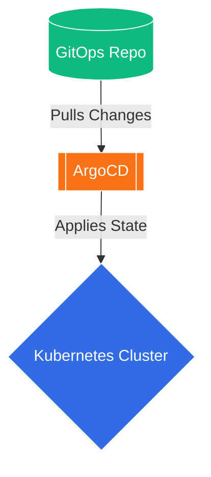

</div>

</div>
</Transform>

</div>

---
layout: default
---

<div class="-mt-7">

# Ansible & Infrastructure

<div class="flex items-center gap-4 mb-2">
  <div class="bg-white p-2 rounded-lg">
    
  </div>
  <h2 class="text-3xl font-bold text-red-500">Automating the Bare Metal</h2>
</div>

<Transform origin="top-left">
<div class="grid grid-cols-2 gap-8 items-center w-[120%]">

<div>
  <v-clicks>
  <p class="text-gray-300 mb-4 bg-gray-900/50 p-4 rounded-xl border border-gray-700">
    This is where <strong>Ansible</strong> then comes in. Ansible can initially configure the servers, but then Ansible uses a push model. This is unsecure, so after the initial configuration we need to remove the access that Ansible has to the servers, but then how do we constantly apply new changes?
  </p>
  <p class="text-gray-300 mb-4 bg-red-950/30 p-4 rounded-xl border border-red-900 border-l-4 border-l-red-500">
    Ansible has a module called <strong>"ansible pull"</strong>, which can work just like ArgoCD, but it is not as robust.
  </p>
  <p class="text-gray-400 text-sm">
    To make Ansible work just like ArgoCD, I have a list of tools and workflows in mind that I can test, but only after all of this. We then finally have a single or multiple GitOps repositories, which are the only source of truth, and manage all the servers and clusters.
  </p>
  </v-clicks>
</div>

<!-- Added w-10/12 to reduce width, and -ml-12 to move it to the left to match the ArgoCD slide -->
<div class="bg-gray-900/80 p-4 rounded-3xl border border-gray-700 shadow-xl flex justify-center w-3/5 -ml">

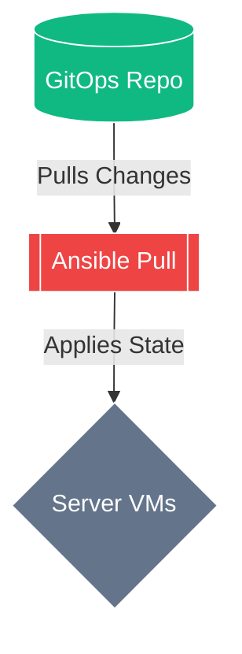
</div>
</div>
</Transform>

</div>

---
layout: center
transition: zoom
---

# Final CI/CD Pipeline

<p class="text-xl text-gray-300 text-center mb-6">This is our final, complete CI/CD and GitOps Pipeline architecture.</p>

<div class="bg-gray-900/80 p-6 rounded-3xl border border-gray-700 shadow-2xl backdrop-blur-md flex items-center justify-center overflow-visible my-auto min-h-[420px]">
<Transform origin="center">

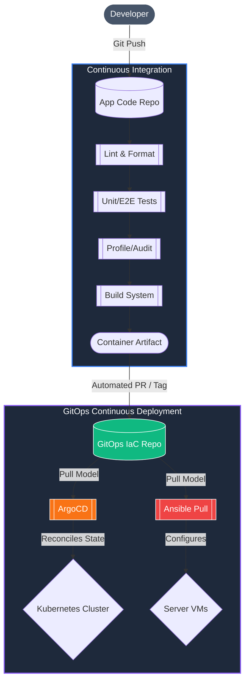

</Transform>
</div>

---
transition: slide-up
layout: two-cols-header
---

# Dual CI Pipelines Overview
<p class="opacity-75 -mt-4 mb-8 text-lg">Tailoring continuous integration to specialized project ecosystems</p>

::left::

<!-- Replaced pr-3 with mr-2, increased padding, and forced the box to fill the vertical space -->
<div v-click class="p-8 bg-blue-950/30 border border-blue-800/50 rounded-2xl mb-3 h-full flex flex-col justify-center mr-2">
  <div class="flex items-center gap-3 text-blue-400 font-bold text-xl mb-3">
    <div class="i-logos-react inline-block text-2xl"></div> React Frontend Pipeline
  </div>
  <p class="text-sm opacity-80 mb-6 leading-relaxed">Designed for modern UI applications and JavaScript/TypeScript ecosystems.</p>
  <div class="flex flex-wrap gap-2 text-xs">
    <span class="px-3 py-1.5 bg-blue-500/20 text-blue-300 rounded-md">npm</span>
    <span class="px-3 py-1.5 bg-blue-500/20 text-blue-300 rounded-md">Vite / Vitest</span>
    <span class="px-3 py-1.5 bg-blue-500/20 text-blue-300 rounded-md">ESLint / Prettier</span>
    <span class="px-3 py-1.5 bg-blue-500/20 text-blue-300 rounded-md">Storybook</span>
    <span class="px-3 py-1.5 bg-blue-500/20 text-blue-300 rounded-md">Playwright</span>
    <span class="px-3 py-1.5 bg-blue-500/20 text-blue-300 rounded-md">Unlighthouse</span>
  </div>
</div>

::right::

<!-- Replaced pl-3 with ml-2, increased padding, and forced the box to fill the vertical space -->
<div v-click class="p-8 bg-amber-950/30 border border-amber-800/50 rounded-2xl mb-3 h-full flex flex-col justify-center ml-2">
  <div class="flex items-center gap-3 text-amber-400 font-bold text-xl mb-3">
    <div class="i-carbon-bare-metal-server inline-block text-2xl"></div> Advanced Backend Pipeline
  </div>
  <p class="text-sm opacity-80 mb-6 leading-relaxed">More advanced pipeline engineered for high-performance Rust & Python services.</p>
  <div class="flex flex-wrap gap-2 text-xs">
    <span class="px-3 py-1.5 bg-amber-500/20 text-amber-300 rounded-md">PreK</span>
    <span class="px-3 py-1.5 bg-amber-500/20 text-amber-300 rounded-md">Ruff / Pyright</span>
    <span class="px-3 py-1.5 bg-amber-500/20 text-amber-300 rounded-md">Pytest + Coverage</span>
    <span class="px-3 py-1.5 bg-amber-500/20 text-amber-300 rounded-md">Scalene</span>
    <span class="px-3 py-1.5 bg-amber-500/20 text-amber-300 rounded-md">Makefile / Bash</span>
    <span class="px-3 py-1.5 bg-amber-500/20 text-amber-300 rounded-md">Release Please</span>
  </div>
</div>

::bottom::

<!-- Added mt-8 to push it downward, increased padding, and bumped text size -->
<div v-click class="mt-8 p-5 bg-neutral-800/80 rounded-xl border border-neutral-700 text-sm opacity-90 leading-relaxed shadow-lg mx-1">
  💡 <strong>Why do they differ?</strong> Different projects use different languages, package managers, and build systems, and some of the steps of a continuous integration pipeline rely on these choices. Different package managers each have their own automation tools available, and different languages need their own static analysis tools, like linters.
</div>

---
transition: fade
layout: default
---

# React Frontend CI Pipeline
<p class="opacity-75 -mt-4 mb-6 text-lg">Architecture and tooling for modern user interfaces</p>

<!-- Flex container to distribute the diagram and cards evenly -->
<div class="flex flex-col justify-between pb-8">

  <!-- Diagram container: Centered and scaled natively via Mermaid -->
  <div class="flex justify-center w-full mb-8">

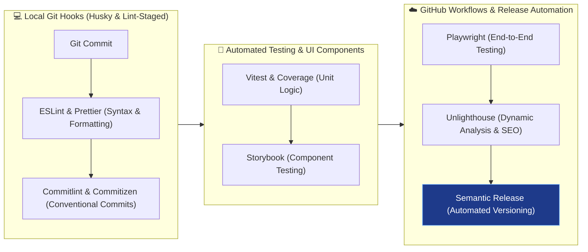

</div>

<div class="grid grid-cols-2 gap-4 mt-2 text-xs">
  <div v-click class="p-3 bg-neutral-800/60 rounded border border-neutral-700">
    <strong class="text-blue-400 flex items-center gap-1 mb-1"><div class="i-carbon-checkmark-outline inline-block"></div> Local Verification</strong>
    Utilizes Husky and lint-staged to run quick syntax checks (ESLint, Prettier) and enforce commit message standards (Commitlint) prior to local git commit.
  </div>
  <div v-click class="p-3 bg-neutral-800/60 rounded border border-neutral-700">
    <strong class="text-cyan-400 flex items-center gap-1 mb-1"><div class="i-carbon-cloud-app inline-block"></div> Cloud Execution</strong>
    GitHub Workflows execute heavy suites like Playwright E2E tests, profile dynamic runtime metrics with Unlighthouse, and trigger Semantic Release.
  </div>
</div>
</div>

---
transition: slide-left
layout: default
---

# Advanced Backend CI Pipeline
<p class="opacity-75 -mt-4 mb-6 text-lg">High-performance Rust & Python static and dynamic verification</p>

<!-- Flex container to distribute the diagram and cards evenly -->
<div class="flex flex-col justify-between pb-8">

  <!-- Diagram container: Centered and scaled natively via Mermaid -->
  <div class="flex justify-center w-full mb-8">

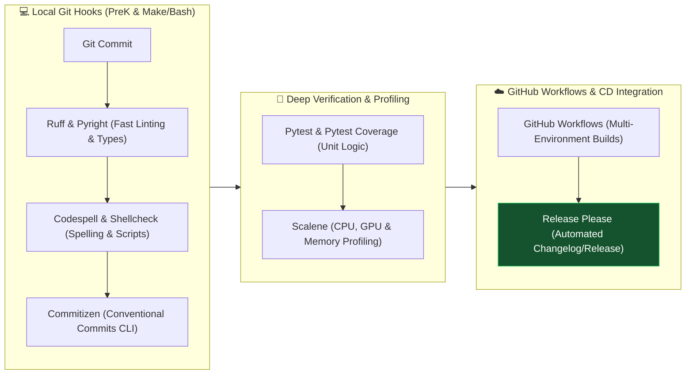

</div>

<div class="grid grid-cols-2 gap-4 mt-2 text-xs">
  <div v-click class="p-3 bg-neutral-800/60 rounded border border-neutral-700">
    <strong class="text-amber-400 flex items-center gap-1 mb-1"><div class="i-carbon-flash inline-block"></div> Why More Advanced?</strong>
    Utilizes PreK (a high-speed Rust rewrite of pre-commit) along with Makefile and Bash scripts to orchestrate complex multi-language checks and type verification (Pyright).
  </div>
  <div v-click class="p-3 bg-neutral-800/60 rounded border border-neutral-700">
    <strong class="text-green-400 flex items-center gap-1 mb-1"><div class="i-carbon-chart-bar inline-block"></div> Dynamic Profiling</strong>
    Integrates Scalene for deep resource profiling and utilizes Release Please to automate GitHub release workflows and version management.
  </div>
</div>
</div>

---
transition: slide-up
layout: two-cols-header
---

# Local CI Automation & The Boy Scout Rule
<p class="opacity-75 -mt-4 mb-4">Ensuring code quality at the commit boundary without slowing down developers</p>

::left::

<div class="pr-3 space-y-3">
  <div v-click class="p-3 bg-neutral-800/60 rounded-lg border border-neutral-700">
    <div class="flex items-center gap-2 text-purple-400 font-bold text-sm mb-1">
      <div class="i-logos-git inline-block"></div> Git-Triggered Execution
    </div>
    <p class="text-xs opacity-85 leading-relaxed">
      The two pipelines follow the same structure: committing changes locally utilizing Git triggers the local part of the CI pipeline. <strong>Husky</strong> and <strong>PreK</strong> ensure distinct scripts run during Git actions.
    </p>
  </div>

  <div v-click class="p-3 bg-neutral-800/60 rounded-lg border border-neutral-700">
    <div class="flex items-center gap-2 text-blue-400 font-bold text-sm mb-1">
      <div class="i-carbon-code inline-block"></div> Fast Static Analysis
    </div>
    <p class="text-xs opacity-85 leading-relaxed">
      Husky and PreK run scripts to perform quick checks on the code, executing linters and formatters—in this case, <strong>Ruff</strong>, <strong>ESLint</strong>, and <strong>Prettier</strong>.
    </p>
  </div>
</div>

::right::

<div class="pl-3">
  <div v-click class="p-4 bg-gradient-to-br from-purple-950/40 to-neutral-900 border border-purple-500/40 rounded-lg shadow-md">
    <div class="flex items-center gap-2 text-purple-300 font-extrabold text-base mb-2">
      <div class="i-carbon-compass text-xl text-purple-400 inline-block"></div> The Boy Scout Rule
    </div>
    <p class="text-xs opacity-90 leading-relaxed mb-3">
      Tools like PreK and lint-staged make sure that <strong>only the changes that you are about to commit are verified and tested</strong>.
    </p>
    <ul class="text-xs space-y-2 opacity-85 pl-4 list-disc mb-3">
      <li>Drastically reduces execution time during local commits.</li>
      <li>Prevents large existing repositories with legacy code from causing the pipeline to constantly fail.</li>
    </ul>
    <div class="p-2 bg-purple-500/10 rounded border border-purple-500/20 text-[11px] text-purple-200 italic">
      “Always leave the codebase cleaner than you found it—without getting bogged down by legacy debt.”
    </div>
  </div>
</div>

---
transition: fade
layout: two-cols-header
---

# Automated Testing & Local Verification
<p class="opacity-75 -mt-4 mb-4">Balancing test rigor with local development velocity</p>

::left::

<div class="pr-3 space-y-3">
  <div v-click class="p-3 bg-neutral-800/60 rounded-lg border border-neutral-700">
    <div class="flex items-center gap-2 text-cyan-400 font-bold text-sm mb-1">
      <div class="i-carbon-chemistry inline-block"></div> Tiered Test Execution
    </div>
    <p class="text-xs opacity-85 leading-relaxed">
      Automated tests verify code functionality using unit testing frameworks (<strong>pytest</strong>, <strong>Vitest</strong>) and component tools (<strong>Storybook</strong>).
    </p>
    <p class="text-xs opacity-75 mt-2 italic">
      ⚠️ End-to-end tests (Playwright) are time-consuming, so they do not run at this local stage.
    </p>
  </div>

  <div v-click class="p-3 bg-neutral-800/60 rounded-lg border border-neutral-700">
    <div class="flex items-center gap-2 text-green-400 font-bold text-sm mb-1">
      <div class="i-carbon-shield inline-block"></div> Coverage Diff
    </div>
    <p class="text-xs opacity-85 leading-relaxed">
      Coverage reports check test percentages against strict failure thresholds. Using <strong>coverage diff</strong> generates reports <em>only for code about to be committed</em>, adhering to the Boy Scout rule.
    </p>
  </div>
</div>

::right::

<div class="pl-3">
  <div v-click class="p-4 bg-neutral-800/80 border border-neutral-600 rounded-lg shadow-sm">
    <div class="flex items-center gap-2 text-amber-400 font-bold text-base mb-2">
      <div class="i-carbon-terminal text-lg inline-block"></div> Standardizing with Commitizen
    </div>
    <p class="text-xs opacity-85 leading-relaxed mb-3">
      After all checks and tests pass, <strong>Commitizen</strong> provides an interactive command-line interface to author commits.
    </p>
    <div class="p-3 bg-black/50 rounded font-mono text-[11px] text-neutral-300 mb-3 space-y-1 border border-neutral-700">
      <div class="text-green-400">? Select the type of change you are committing:</div>
      <div class="text-cyan-300">❯ feat: A new feature</div>
      <div class="opacity-60">  fix: A bug fix</div>
      <div class="opacity-60">  docs: Documentation only changes</div>
    </div>
    <p class="text-xs opacity-80">
      Enforces the <strong>Conventional Commits</strong> specification for clean logs, documentation, and automated downstream changelog generation.
    </p>
  </div>
</div>

---
transition: slide-left
layout: default
---

# External CI Pipeline in the Cloud
<p class="opacity-75 -mt-4 mb-5">Rerunning validation and dynamic profiling across GitHub Workflows</p>

<div class="grid grid-cols-3 gap-4 mb-6 mt-4">
  <div class="p-4 bg-neutral-800/70 rounded-lg border border-neutral-700 flex flex-col h-full">
    <strong class="text-blue-400 flex items-center gap-1.5 text-base mb-2">
      <div class="i-logos-github-icon text-xl inline-block"></div> GitHub Workflows
    </strong>
    <p class="opacity-85 leading-relaxed text-xs">
      Pushing code and opening a pull request triggers cloud workflows—selected for their simplicity and native GitHub integration. Reruns all local checks plus heavy end-to-end suites (<strong>Playwright</strong>).
    </p>
  </div>

  <div v-click class="p-4 bg-neutral-800/70 rounded-lg border border-neutral-700 flex flex-col h-full">
    <strong class="text-purple-400 flex items-center gap-1.5 text-base mb-2">
      <div class="i-carbon-chip text-xl inline-block"></div> Dynamic Analysis
    </strong>
    <p class="opacity-85 leading-relaxed text-xs">
      Builds and tests code across multiple runtime environments. Utilizes dynamic analysis tools to profile software as it runs: <strong>Scalene</strong> (resource profiling) and <strong>Unlighthouse</strong> (live site quality & SEO).
    </p>
  </div>

  <div v-click class="p-4 bg-neutral-800/70 rounded-lg border border-neutral-700 flex flex-col h-full">
    <strong class="text-green-400 flex items-center gap-1.5 text-base mb-2">
      <div class="i-carbon-launch text-xl inline-block"></div> Semantic Releases
    </strong>
    <p class="opacity-85 leading-relaxed text-xs">
      After AI code review, tools like <strong>release-please</strong> and <strong>semantic-release</strong> automate version bumps and package distributions following the Semantic Versioning specification.
    </p>
  </div>
</div>

<div v-click class="w-full h-36 rounded-xl overflow-hidden border border-neutral-700 shadow-[0_4px_20px_rgba(0,0,0,0.5)]">
  
</div>

---
transition: slide-up
layout: two-cols-header
---

# Continuous Deployment & GitOps
<p class="opacity-75 -mt-4 mb-4">Orchestrating containers with Kubernetes, ArgoCD, and Ansible</p>

::left::

<div class="pr-3 space-y-3">
  <div v-click class="p-3 bg-neutral-800/60 rounded-lg border border-neutral-700">
    <div class="flex items-center gap-2 text-red-400 font-bold text-sm mb-1">
      <div class="i-carbon-automation inline-block"></div> Ansible IT Automation
    </div>
    <p class="text-xs opacity-85 leading-relaxed">
      Ansible automates server management, downloading <strong>k3s</strong> to provision a lightweight Kubernetes cluster across dedicated development, staging, and production server nodes.
    </p>
  </div>

  <div v-click class="p-3 bg-neutral-800/60 rounded-lg border border-neutral-700">
    <div class="flex items-center gap-2 text-blue-400 font-bold text-sm mb-1">
      <div class="i-logos-kubernetes inline-block"></div> Container Orchestration
    </div>
    <p class="text-xs opacity-85 leading-relaxed">
      Kubernetes manages large amounts of containerized applications—isolating software packages so they can be easily transported, scaled, and executed anywhere.
    </p>
  </div>
</div>

::right::

<div class="pl-3">
  <div v-click class="p-4 bg-gradient-to-br from-cyan-950/40 to-neutral-900 border border-cyan-500/40 rounded-lg shadow-md">
    <div class="flex items-center gap-2 text-cyan-300 font-extrabold text-base mb-2">
      <div class="i-logos-git inline-block"></div> ArgoCD & "X as Code"
    </div>
    <p class="text-xs opacity-90 leading-relaxed mb-3">
      Ansible installs and configures <strong>ArgoCD</strong>, a GitOps continuous deployment controller for Kubernetes.
    </p>
    <ul class="text-xs space-y-2 opacity-85 pl-4 list-disc mb-3">
      <li>Constantly pulls <strong>X as code</strong> (infrastructure and configuration files defining environment state) from a side GitOps GitHub repository.</li>
      <li>Fetches the final build images from registries and applies configurations to the cluster.</li>
      <li>Ensures the entire project is deployed, synchronized, and ready.</li>
    </ul>
  </div>
</div>

---
transition: fade
layout: default
---

# GitOps Validation & CIARA Feedback
<p class="opacity-75 -mt-4 mb-4">Ensuring infrastructure reliability and real-world developer alignment</p>

<div class="grid grid-cols-3 gap-4 my-4">
  <div v-click class="p-4 bg-neutral-800/60 rounded-lg border border-neutral-700 flex flex-col justify-between">
    <div>
      <div class="p-2 bg-purple-500/20 rounded-md text-purple-400 w-fit mb-3"><div class="i-carbon-security text-2xl inline-block"></div></div>
      <h3 class="text-base font-bold text-white mb-2">Independent GitOps CI</h3>
      <p class="text-xs opacity-80 leading-relaxed">
        The side GitOps repository containing all infrastructure as code was independently linted and verified using its own dedicated CI pipeline to prevent cluster misconfigurations.
      </p>
    </div>
    <div class="mt-4 pt-2 border-t border-neutral-700/60 text-[10px] text-purple-300 font-mono">
      ✓ IaC Verified & Linted
    </div>
  </div>

  <div v-click class="p-4 bg-neutral-800/60 rounded-lg border border-neutral-700 flex flex-col justify-between">
    <div>
      <div class="p-2 bg-blue-500/20 rounded-md text-blue-400 w-fit mb-3"><div class="i-carbon-book text-2xl inline-block"></div></div>
      <h3 class="text-base font-bold text-white mb-2">Creation Documentation</h3>
      <p class="text-xs opacity-80 leading-relaxed">
        After finalizing the pipeline architectures, comprehensive creation documentation and architectural runbooks were written to ensure seamless onboarding and reproducible deployments.
      </p>
    </div>
    <div class="mt-4 pt-2 border-t border-neutral-700/60 text-[10px] text-blue-300 font-mono">
      ✓ Runbooks Authored
    </div>
  </div>

  <div v-click class="p-4 bg-neutral-800/60 rounded-lg border border-neutral-700 flex flex-col justify-between">
    <div>
      <div class="p-2 bg-green-500/20 rounded-md text-green-400 w-fit mb-3"><div class="i-carbon-group text-2xl inline-block"></div></div>
      <h3 class="text-base font-bold text-white mb-2">CIARA Developer Feedback</h3>
      <p class="text-xs opacity-80 leading-relaxed">
        The complete pipeline was distributed to software developers across major CIARA research projects to gather practical feedback and validate real-world performance.
      </p>
    </div>
    <div class="mt-4 pt-2 border-t border-neutral-700/60 text-[10px] text-green-300 font-mono">
      ✓ AW-SDX | Kytos-NG | Amlight
    </div>
  </div>
</div>

<div v-click class="p-3 bg-neutral-900/90 rounded border border-neutral-700 text-center text-xs opacity-90">
  🚀 <strong>Outcome:</strong> Bridged the gap between academic architecture and production-grade network engineering workflows.
</div>

---
transition: slide-up
layout: default
---

# AI Integration: CodiumAI PR Agent
<p class="opacity-75 -mt-4 mb-6 text-lg">Bridging deterministic verification with intelligent LLM code analysis</p>

<!-- Flex container to distribute the diagram and cards evenly -->
<div class="flex flex-col justify-between pb-8">

  <!-- Diagram container: Centered and scaled natively via Mermaid -->
  <div class="flex justify-center w-full mb-8">

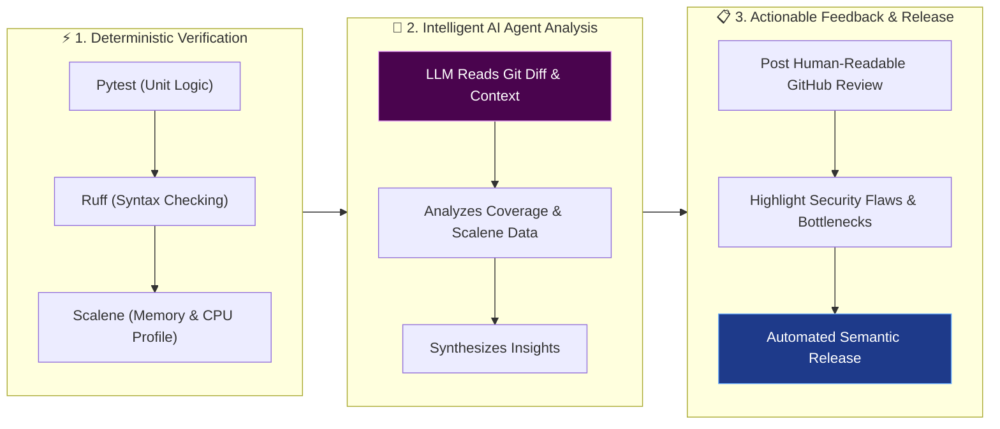

</div>

<div class="grid grid-cols-3 gap-3 mt-2 text-xs">
  <div v-click class="p-2.5 bg-neutral-800/60 rounded border border-neutral-700">
    <strong class="text-blue-400 block mb-1">1. Deterministic First</strong>
    Standard tools run first within GitHub Workflows: Pytest tests logic, Ruff checks syntax, and Scalene profiles memory usage.
  </div>
  <div v-click class="p-2.5 bg-neutral-800/60 rounded border border-neutral-700">
    <strong class="text-purple-400 block mb-1">2. Contextual AI Review</strong>
    The LLM reads git diffs, checks surrounding files for deep context, and correlates test coverage with Scalene profiling data.
  </div>
  <div v-click class="p-2.5 bg-neutral-800/60 rounded border border-neutral-700">
    <strong class="text-green-400 block mb-1">3. Automated Release</strong>
    After human-readable review and feedback, automated tools (release-please, semantic-release) finalize semantic versioning.
  </div>
</div>
</div>

---
transition: fade
layout: two-cols-header
---

# AI Reviewer Capabilities & Future Roadmap
<p class="opacity-75 -mt-4 mb-4">Enhancing developer velocity with intelligent feedback and continuous evolution</p>

::left::

<div class="pr-3">
  <div class="p-4 bg-purple-950/30 border border-purple-800/50 rounded-lg mb-3">
    <div class="flex items-center gap-2 text-purple-400 font-bold text-base mb-2">
      <div class="i-carbon-bot text-lg inline-block"></div> What the AI Agent Delivers
    </div>
    <ul class="text-xs space-y-2.5 opacity-90 pl-4 list-disc">
      <li v-click><strong>Logical Inconsistencies:</strong> Points out subtle logical flaws in commit diffs by evaluating surrounding file context.</li>
      <li v-click><strong>Advanced Security Scans:</strong> Highlights vulnerability patterns and security risks missed by standard static analysis scans.</li>
      <li v-click><strong>Performance Refactoring:</strong> Suggests concrete code refactoring directly based on Scalene memory and CPU bottlenecks.</li>
      <li v-click><strong>Seamless Release:</strong> Paves the way for automated releases via release-please and semantic-release.</li>
    </ul>
  </div>
</div>

::right::

<div class="pl-3">
  <div class="p-4 bg-cyan-950/30 border border-cyan-800/50 rounded-lg mb-3">
    <div class="flex items-center gap-2 text-cyan-400 font-bold text-base mb-2">
      <div class="i-carbon-idea text-lg inline-block"></div> Possible AI Improvements
    </div>
    <ul class="text-xs space-y-2.5 opacity-90 pl-4 list-disc">
      <li v-click><strong>Autonomous Remediation:</strong> Evolving from review suggestions to auto-generating pull requests that fix identified Scalene bottlenecks and security flaws.</li>
      <li v-click><strong>Domain-Specific Tuning:</strong> Fine-tuning the LLM reviewer on historical codebases and networking architectures specific to CIARA projects (AW-SDX, Kytos-NG).</li>
      <li v-click><strong>Dynamic Test Generation:</strong> Automatically writing unit test assertions for untested code paths uncovered during coverage diff checks.</li>
    </ul>
  </div>
</div>

::bottom::

<div v-click class="mt-2 p-3 bg-neutral-900/90 rounded border border-neutral-700 text-center text-xs opacity-90 italic">
  “This was a lot, but it is the CI pipeline in full.”
</div>

---
layout: center
---

# Conclusions

<div class="max-w-3xl mx-auto space-y-4 mt-8">

<v-click>
<div class="bg-gray-900/70 p-5 rounded-2xl border border-gray-700 flex items-center gap-4 transform transition hover:-translate-y-1 hover:border-cyan-500 shadow-lg">
  <div class="text-4xl text-cyan-400"><div class="i-carbon-settings-check"></div></div>
  <p class="text-lg text-gray-200"><strong>Automation ensures</strong> code quality, testing, and formatting scale seamlessly.</p>
</div>
</v-click>

<v-click>
<div class="bg-gray-900/70 p-5 rounded-2xl border border-gray-700 flex items-center gap-4 transform transition hover:-translate-y-1 hover:border-indigo-500 shadow-lg">
  <div class="text-4xl text-indigo-400"><div class="i-carbon-security"></div></div>
  <p class="text-lg text-gray-200"><strong>CI pipelines catch errors</strong> before they ever reach production.</p>
</div>
</v-click>

<v-click>
<div class="bg-gray-900/70 p-5 rounded-2xl border border-gray-700 flex items-center gap-4 transform transition hover:-translate-y-1 hover:border-emerald-500 shadow-lg">
  <div class="text-4xl text-emerald-400"><div class="i-carbon-code"></div></div>
  <p class="text-lg text-gray-200"><strong>IaC and "X as Code"</strong> allow us to version-control our entire infrastructure.</p>
</div>
</v-click>

<v-click>
<div class="bg-gray-900/70 p-5 rounded-2xl border border-gray-700 flex items-center gap-4 transform transition hover:-translate-y-1 hover:border-orange-500 shadow-lg">
  <div class="text-4xl text-orange-400"><div class="i-carbon-direction-straight-right"></div></div>
  <p class="text-lg text-gray-200"><strong>A Pull-based GitOps model</strong> (ArgoCD / Ansible Pull) ensures peak security and a single source of truth.</p>
</div>
</v-click>

</div>

---
transition: slide-up
layout: default
---

# Acknowledgements

<div class="mt-12 space-y-6 max-w-4xl mx-auto">

<div class="grid grid-cols-2 gap-6">
  <div v-click class="p-6 bg-neutral-800/70 rounded-2xl border border-neutral-700 flex items-center gap-4 hover:border-blue-500 transition-colors shadow-lg">
    <div class="p-3 bg-blue-500/20 rounded-xl text-blue-400">
      <div class="i-carbon-network-4 text-3xl inline-block"></div>
    </div>
    <div class="text-xl font-bold text-white">CIARA</div>
  </div>

  <div v-click class="p-6 bg-neutral-800/70 rounded-2xl border border-neutral-700 flex items-center gap-4 hover:border-amber-500 transition-colors shadow-lg">
    <div class="p-3 bg-amber-500/20 rounded-xl text-amber-400">
      <div class="i-carbon-education text-3xl inline-block"></div>
    </div>
    <div class="text-xl font-bold text-white">The McNair Program</div>
  </div>
</div>

<div class="grid grid-cols-3 gap-6">
  <div v-click class="p-5 bg-neutral-800/70 rounded-2xl border border-neutral-700 flex items-center gap-3 hover:border-purple-500 transition-colors shadow-lg">
    <div class="p-2.5 bg-purple-500/20 rounded-xl text-purple-400">
      <div class="i-carbon-user-avatar text-2xl inline-block"></div>
    </div>
    <div class="font-semibold text-white text-base">Dr. Vasilka Chergarova</div>
  </div>

  <div v-click class="p-5 bg-neutral-800/70 rounded-2xl border border-neutral-700 flex items-center gap-3 hover:border-purple-500 transition-colors shadow-lg">
    <div class="p-2.5 bg-purple-500/20 rounded-xl text-purple-400">
      <div class="i-carbon-user-avatar text-2xl inline-block"></div>
    </div>
    <div class="font-semibold text-white text-base">Vinicius Arcanjo</div>
  </div>

  <div v-click class="p-5 bg-neutral-800/70 rounded-2xl border border-neutral-700 flex items-center gap-3 hover:border-purple-500 transition-colors shadow-lg">
    <div class="p-2.5 bg-purple-500/20 rounded-xl text-purple-400">
      <div class="i-carbon-user-avatar text-2xl inline-block"></div>
    </div>
    <div class="font-semibold text-white text-base">Jeronimo Bezerra</div>
  </div>
</div>

</div>

---
layout: two-cols
---

# Resources & Next Steps

<div class="mt-12 mr-8">
  <p class="text-xl text-gray-300 leading-relaxed mb-8">
    Thank you for attending. If you want to dive deeper into the code, architecture diagrams, or connect with me, please scan the QR code.
  </p>

  <div class="space-y-4">
    <div class="flex items-center gap-3 text-cyan-400 hover:text-cyan-300 cursor-pointer transition-colors">
      <div class="i-carbon-logo-github text-2xl"></div>
      <span class="text-lg font-mono">github.com/HeriLFIU</span>
    </div>
    <div class="flex items-center gap-3 text-blue-400 hover:text-blue-300 cursor-pointer transition-colors">
      <div class="i-carbon-logo-linkedin text-2xl"></div>
      <span class="text-lg font-mono">linkedin.com/in/heribertoluna</span>
    </div>
  </div>
</div>

::right::

<div class="h-full flex flex-col justify-center items-center">
  <div class="bg-white p-8 rounded-3xl shadow-[0_0_40px_rgba(255,255,255,0.1)] transform hover:scale-105 transition duration-500">
    
  </div>
  <p class="text-gray-400 mt-6 text-sm tracking-widest uppercase font-bold">Scan for Slides & Code</p>
</div>

---
layout: center
transition: fade
---

<div class="text-center my-auto bg-dark-900/50 p-16 rounded-3xl border border-gray-700 shadow-2xl backdrop-blur-md max-w-4xl mx-auto">

<h1 class="text-7xl font-black tracking-tight mb-8 bg-gradient-to-r from-gray-200 to-gray-500 bg-clip-text text-transparent">Questions?</h1>

<div class="w-24 h-1 bg-gray-600 my-8 mx-auto rounded-full"></div>

<p class="text-2xl text-gray-300 font-light mb-4">
  Thank you for your time and attention.
</p>

<div class="mt-8 pt-8 border-t border-gray-700/50">
  <p class="text-xl font-bold text-cyan-400 tracking-wide">Heriberto Luna</p>
  <p class="text-gray-400 uppercase tracking-widest text-sm mt-2 font-bold">Florida International University CIARA</p>
</div>

</div>
